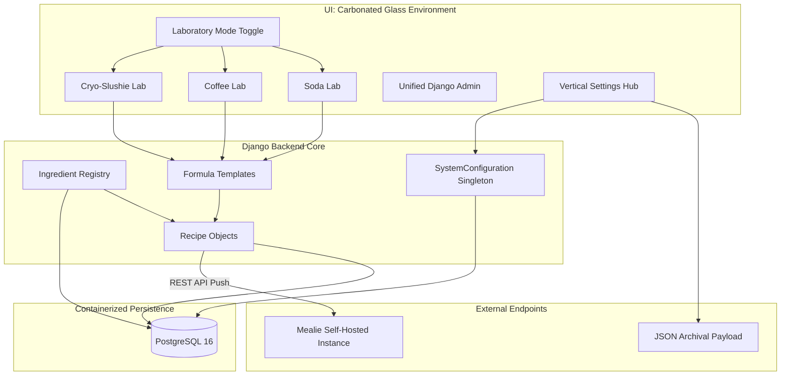

# 🧪 Beverage Laboratory: Carbonated Glass Edition

A premium, high-end "Beverage Laboratory" experience designed for the modern home scientist. Originally built for SodaStream chemistry, the laboratory has now expanded to support a comprehensive suite of extraction and synthesis environments—all encased in the stunning **Carbonated Glass** design system.

---

## 🌑 The Aesthetic: Carbonated Glass
The Beverage Laboratory introduces a cutting-edge visual framework that prioritizes premium aesthetics and intuitive data visualization across both the consumer-facing frontend and the Django Admin suite:
- **Glassmorphism Shell**: Translucent surfaces with deep backdrop blurs and subtle reflections.
- **Neon-Glow HSL**: Vibrant, high-contrast color tokens (Lime, Orange, Cyan) optimized for a deep charcoal dark mode.
- **Modern Typography**: High-legibility "Outfit" font system for a clean, tech-first readout.
- **Unified Administration**: The native Django admin has been entirely overhauled to match the frontend, replacing the legacy 1.0 layouts with responsive Flexbox/Grid systems and dynamic glass elements.

## 🚀 Laboratory Environments

The application operates fundamentally split into three distinct laboratory environments:

### 💧 1. Soda Laboratory
- **Symphonic Formulation**: Precisely catalog syrups, flavor drops, and additives.
- **3-Tiered Recommendation Engine**: Programmatic analysis suggesting compatible secondary and tertiary compounds based on molecular category and potency.
- **Automated Lexicon**: Deterministic laboratory-grade naming for experimental mixes (e.g., *Atomic Citrus Blast*, *Neural Berry Pulse*).

### ☕ 2. Coffee Extraction Lab
- **Hyper-Specific Telemetry**: Records critical variables including:
  - **Extraction Method**: Espresso, Pour Over, French Press, AeroPress, Cold Brew.
  - **Grind Dialing**: Fine to Coarse granular control.
  - **Thermodynamics**: Real-time tracking of Water Temperature (Celsius/Fahrenheit).
  - **Time/Volume Yield**: Millisecond extraction logging.
- **Origin Analytics**: Logs coffee bean origin, roast level, and specific processing methods.

### ❄️ 3. Cryo-Slushie Lab
- **Brix Optimization**: Advanced syntax processing specialized for the Ninja Slushi hardware.
- **Liquid/Sugar Parity**: Real-time ratio monitors enforcing the strict 5:1 volumetric rule required to maintain frozen texture without freezing the auger.

---

## 📊 System Architecture & Telemetry

### 📡 External Integrations (Target: Mealie)
The Beverage Laboratory does not exist in a silo. It connects seamlessly to your external Recipe endpoints.
- **API Persistence**: Secure, database-backed storage of your self-hosted Mealie Node URL and Private API Tokens.
- **1-Click Sync**: "Push to Mealie" rapid-action dispatching on all laboratory formulas.
- **Payload Translation**: Automatically maps specialized lab data (Intensities, Milliliters, Grams, Temperatures) into the standardized Mealie JSON Recipe Format without any data loss.

### 🧠 Central Command Dashboard
- **Dynamic Hall of Fame**: Real-time, theme-aware telemetry on aggregate laboratory performance:
    - **MVP Flavors**: Most utilized baseline compounds for the active lab.
    - **Leading Profiles**: Highest rated formulation categories.
    - **Signature Mixes**: Most historically reproduced formulas.

### 🛡️ Archival & Data Insurance
- **Vertical Navigation Hub**: Clean, component-based settings architectures.
- **Dossier Export**: Complete laboratory dump (Flavors, Recipes, History) into a single archival JSON format.
- **Target Merging**: Re-integration protocol prioritizing existing chemical identities to prevent database duplication.

---

## 🗺️ Architectural Topology



---

## 🛠️ Laboratory Stack

- **Framework**: Django 5.x (Python 3.12+)
- **Database**: PostgreSQL 16 (Containerized)
- **UI Engine**: Custom Carbonated Glass CSS (Vanilla)
- **Networking**: `requests` for robust REST API dispatching
- **Deployment**: Docker Compose Orchestration
- **Performance**: Gunicorn production server with health-check monitoring

---

## 🧪 Installation Protocols

### 🐳 Docker Deployment (Recommended)
Initiate the full laboratory environment including the PostgreSQL core:

```bash
docker compose up -d --build
```

The laboratory terminal will be accessible at `http://localhost:8000`.

### 💻 Manual Configuration (Developer Mode)

1. **Environment Setup**:
   Copy the laboratory template to initiate your local config:
   ```bash
   cp .env.template .env
   ```
   *Note: Ensure the `DATABASE_HOST` is set to `localhost` if running outside of Docker.*

2. **Install Dependencies**:
   ```bash
   pip install -r requirements.txt
   ```

3. **Database Migration**:
   ```bash
   python manage.py migrate
   ```

4. **Initialize Server**:
   ```bash
   python manage.py runserver
   ```

---

## ⚖️ License
MIT License - Developed for high-precision home experimentation.